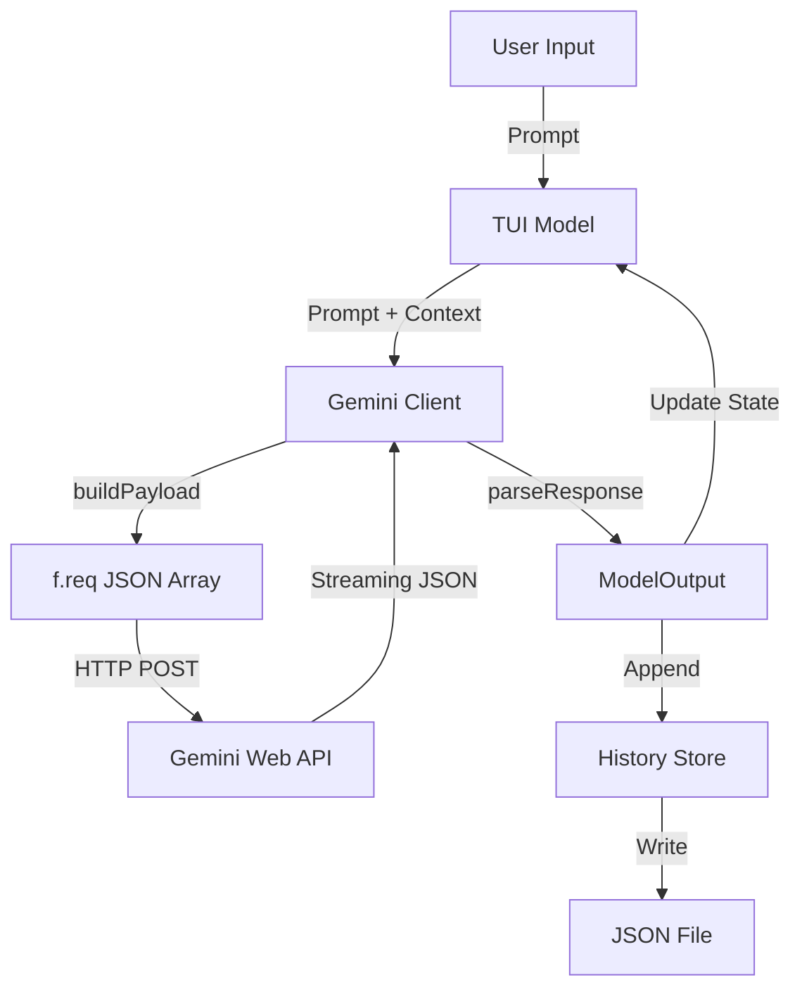
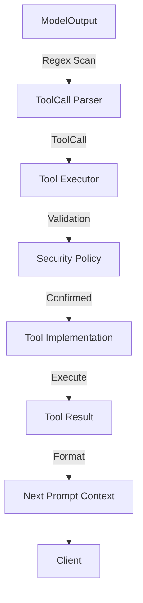

# Data Flow Analysis

This document provides a detailed analysis of how data flows, transforms, and persists within the `geminiweb-go` application, tracing the journey from user input to API interaction and local storage.

## Data Models Overview

The application utilizes several distinct sets of data models optimized for different layers of the system:

-   **Domain Models (`internal/models`)**:
    -   `ModelOutput`: Represents the structured response from Gemini, containing `Candidate` objects, metadata (CID, RID, RCID), and extension flags.
    -   `Candidate`: Individual response variations from the AI, including text, "thoughts" (for thinking models), and image references.
    -   `Gem`: Represents server-side personas with an ID, name, and system prompt.
    -   `Message`: A simple TUI-centric representation of a chat message (Role and Content).

-   **Persistence Models (`internal/history`)**:
    -   `Conversation`: The root persistence object containing a collection of messages, metadata for session resumption (CID, RID), and lifecycle timestamps.
    -   `Message`: A persistence-ready message structure including `Thoughts` and `Timestamp`.
    -   `ConversationMeta`: Lightweight metadata stored in `meta.json` for fast indexing and favorite status.

-   **Tool Execution Models (`pkg/toolexec`)**:
    -   `ToolCall`: Parsed from AI-generated markdown blocks, containing tool name and arguments.
    -   `Input`/`Output`: Generic structures for passing parameters and returning results from tools.
    -   `ToolCallResult`: The serialized output sent back to the AI model to inform subsequent turns.

## Data Transformation Map

Data undergoes several key transformations as it moves through the system:

1.  **Input to Request**:
    -   User prompt + metadata + files are passed to `api.GenerateContent`.
    -   `buildPayloadWithGem` transforms these into a deeply nested JSON array structure.
    -   The JSON is then serialized into a form-encoded string assigned to the `f.req` parameter for the Gemini Web API.

2.  **Raw Response to Domain Model**:
    -   The API returns a streaming format with multiple JSON chunks separated by size prefixes.
    -   `parseResponse` uses the `gjson` library to navigate the complex nested arrays.
    -   It identifies the correct data path (which differs for standard vs. extension responses) and maps fields into `models.ModelOutput`.

3.  **Domain Model to Persistence**:
    -   `ModelOutput` is converted into a `history.Message` within the TUI `Update` loop or a command handler.
    -   The message is appended to a `history.Conversation` and serialized as an indented JSON file.

4.  **AI Response to Tool Execution**:
    -   Assistant text content is scanned for ` ```tool ` blocks using regex.
    -   `toolexec.ParseToolCalls` deserializes the JSON within blocks into `ToolCall` objects.
    -   `ToolCall` is transformed into `toolexec.Input` for the execution engine.

## Storage Interactions

The application employs a file-based persistence strategy:

-   **History Storage**: Conversations are stored in `~/.geminiweb/history/`.
    -   **Individual Files**: Each conversation is a `{conv-id}.json` file.
    -   **Global Index**: A `meta.json` file maintains the ordering, favorite status, and cached titles for the UI.
-   **Configuration**: Cookies and user-defined personas are stored in `~/.config/geminiweb/` or a custom directory.
-   **Caching**:
    -   The `api.GeminiClient` maintains an in-memory `GemJar` cache of available Gems.
    -   The TUI `Model` maintains the current session's message list in memory for rapid rendering.

## Validation Mechanisms

Data integrity is maintained through multi-stage validation:

-   **Authentication Validation**: `config.ValidateCookies` ensures required security tokens (`__Secure-1PSID`, etc.) are present before attempting API calls.
-   **Input Validation**: `api.GenerateContent` checks for empty prompts and closed client states.
-   **Tool Validation**:
    -   `tc.Validate()` ensures AI-generated tool calls contain both a name and arguments.
    -   `pkg/toolexec` implements a `SecurityPolicy` interface to validate tool execution against a set of rules.
    -   `ConfirmationHandler` provides a hook for manual user approval for sensitive operations.

## State Management Analysis

The application follows "The Elm Architecture" pattern via the Bubble Tea framework:

-   **TUI State (`tui.Model`)**:
    -   Maintains the `viewport`, `textarea`, and `spinner` component states.
    -   Tracks the `loading` status, `err` state, and current `conversation` context.
    -   Manages transient UI states like `selectingGem`, `selectingHistory`, and `selectingImages`.
-   **Session State**:
    -   `api.ChatSession` maintains the sequence of `CID`, `RID`, and `RCID` tokens required to maintain context across multiple API requests.
-   **Client State**:
    -   `api.GeminiClient` manages the HTTP client lifecycle, cookie rotation timers, and auto-close/re-init logic based on activity.

## Serialization Processes

-   **JSON Serialization**: Standard `encoding/json` is used for history files and `toolexec` protocols.
-   **JSON Extraction**: `tidwall/gjson` is used for high-performance extraction of specific fields from the large, deeply nested Gemini API responses without full unmarshaling into complex structs.
-   **Form Encoding**: Used for sending the `f.req` payload to the Gemini API.
-   **Markdown Rendering**: The `internal/render` package transforms `models.Message` content into styled terminal output using the `glamour` library.

## Data Lifecycle Diagrams

### Standard Request Flow


### Tool Execution Flow
