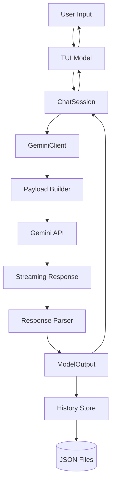
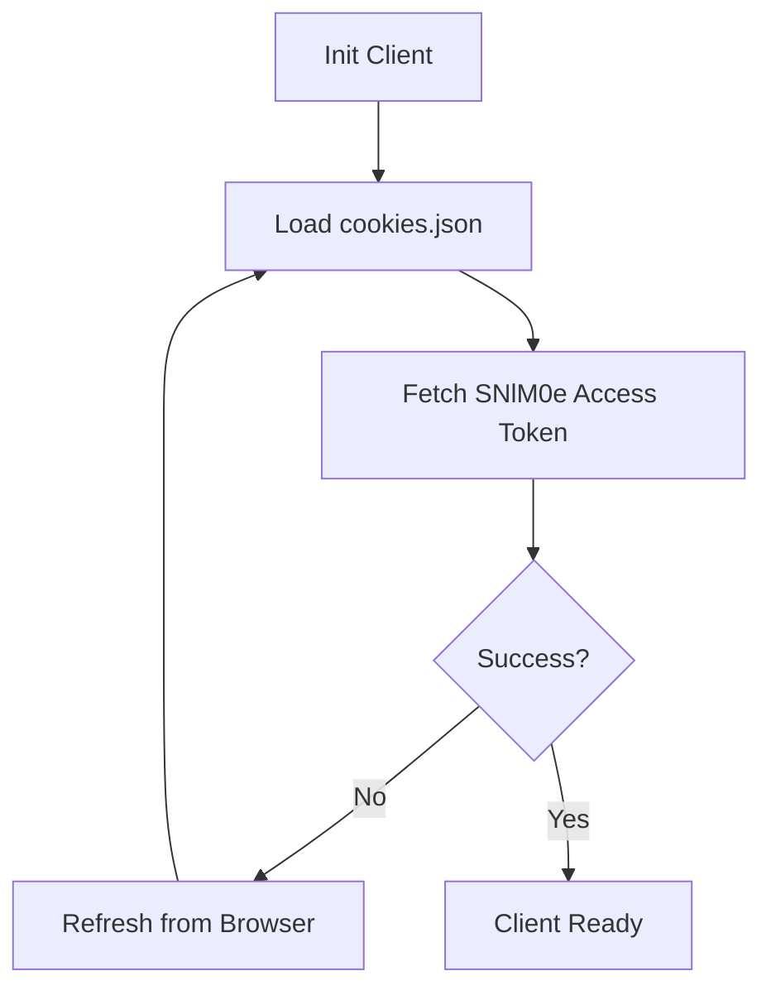

# Data Flow Analysis

This document provides a comprehensive analysis of how data flows, transforms, and persists within the `geminiweb-go` application.

## Data Models Overview

The application utilizes several key data structures to represent the lifecycle of a conversation and its associated metadata:

- **`models.ModelOutput`**: The primary structure for holding responses from the Gemini API. It contains a list of `Candidate` objects, metadata (CID, RID, RCID), and identifies if the response came from an extension (e.g., @Gmail).
- **`models.Candidate`**: Represents a single response choice from the model, including the text, AI "thoughts" (for thinking models), and any web or generated images.
- **`history.Conversation`**: The persistence model for a chat session. It stores a unique ID, title, model name, timestamps, and a slice of `Message` objects. It also caches Gemini API metadata (CID, RID, RCID) to allow resuming conversations.
- **`history.Message`**: A simple structure for individual chat entries, including the role (user/assistant), content, thoughts, and a timestamp.
- **`models.Gem`**: Represents a custom persona (system prompt) stored on Google's servers.
- **`config.Persona`**: Represents a local system prompt configuration, allowing for predefined and user-defined personas without relying on server-side Gems.
- **`config.Cookies`**: Manages the authentication state (`__Secure-1PSID` and `__Secure-1PSIDTS`).

## Data Transformation Map

Data undergoes several transformations as it moves from the user interface to the API and back to persistence:

1.  **Input to Payload**:
    - The user's prompt and optional file attachments are combined with session metadata (CID, RID, RCID) in `internal/api/generate.go`.
    - `buildPayloadWithGem` transforms these into a nested JSON structure (the `f.req` parameter) required by the Gemini Web API.
2.  **API Response to ModelOutput**:
    - The Gemini API returns a streaming response containing multiple JSON chunks.
    - `parseResponse` in `internal/api/generate.go` uses `gjson` to navigate this complex, nested structure, identifying the correct chunk and extracting text, thoughts, images, and metadata.
    - This raw data is mapped into a `models.ModelOutput` struct.
3.  **ModelOutput to History**:
    - When a response is received, the TUI or CLI transforms the `ModelOutput` into a `history.Message`.
    - The `ChatSession` updates its internal metadata (CID, RID, RCID) based on the latest `ModelOutput` to maintain context for subsequent requests.
4.  **History to Persistence**:
    - The `history.Store` marshals `history.Conversation` objects into JSON format for storage on disk.

## Storage Interactions

- **Local File System**: 
    - **History**: Conversations are stored as individual JSON files in `~/.config/geminiweb/history/`.
    - **Metadata**: A `meta.json` file in the history directory maintains the order of conversations and their "favorite" status.
    - **Configuration**: `cookies.json` and `personas.json` store authentication state and custom personas, respectively.
- **Google Gemini API**: Acts as the remote "database" for generating content and managing server-side Gems. The application interacts with it via authenticated HTTP POST requests.

## Validation Mechanisms

- **Cookie Validation**: `config.ValidateCookies` ensures that at least the `__Secure-1PSID` cookie is present before attempting API calls.
- **Input Validation**: `doGenerateContent` ensures the prompt is not empty. The TUI limits input length via `textarea.CharLimit`.
- **API Error Handling**: `internal/errors` provides structured error types (e.g., `AuthError`, `ParseError`, `NetworkError`). The response parsing logic checks for specific Google error codes (e.g., `ErrorCode`) and handles them accordingly.
- **Auth Retries**: If an authentication error is detected, the `GeminiClient` can automatically attempt to refresh cookies from a local browser if configured.

## State Management Analysis

- **`api.ChatSession`**: Manages the ephemeral state of a single conversation, specifically the `CID` (Conversation ID), `RID` (Reply ID), and `RCID` (Reply Candidate ID). This state is crucial for "memory" within a chat session.
- **`api.GeminiClient`**: Maintains the global application state, including active cookies, the authenticated access token (`SNlM0e`), cached Gems, and the idle timer for auto-closing.
- **`tui.Model`**: Manages the Bubble Tea UI state, including the message history for the current view, loading indicators, viewport scroll position, and active UI components (like Gem or history selectors).

## Serialization Processes

- **JSON (Standard Library)**: Used for almost all local persistence (`history`, `config`, `personas`) and for building the outgoing API payload.
- **GJSON**: Used for high-performance, path-based extraction from the complex and deeply nested JSON responses returned by the Gemini API.
- **Form Encoding**: The final API request payload is sent as `application/x-www-form-urlencoded` data, where the JSON payload is a value within the `f.req` field.

## Data Lifecycle Diagrams

### Message Flow (Request/Response)

### Authentication Lifecycle
