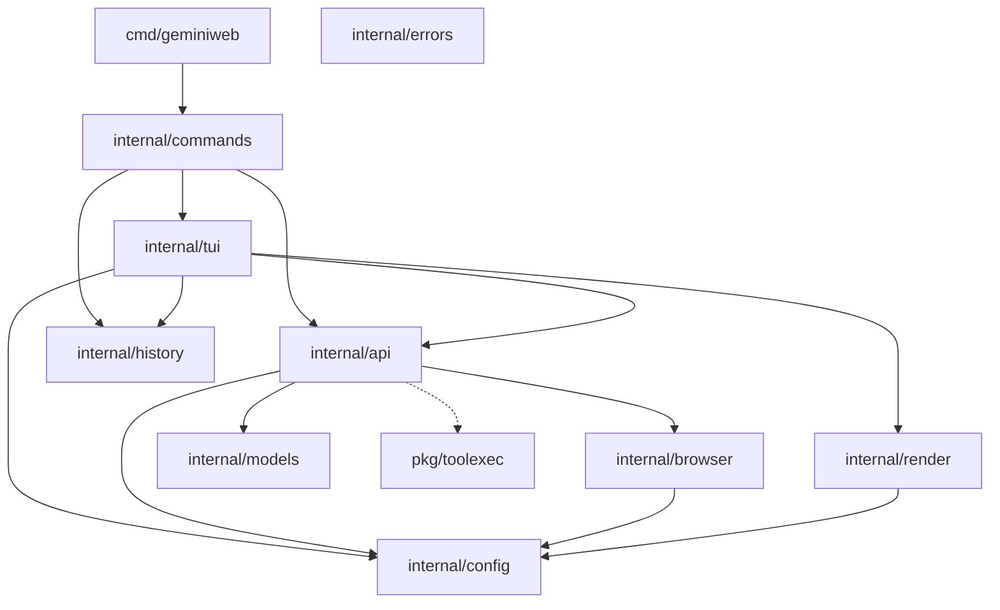

# Dependency Analysis

## Internal Dependencies Map

The `geminiweb-go` project is structured with a clear separation between command-line orchestration, user interface, and the core service client. The dependency flow generally moves from high-level entry points down to specialized service packages.

*   **`cmd/geminiweb`**: The main entry point. It depends exclusively on `internal/commands` to boot the application.
*   **`internal/commands`**: Acts as the primary orchestrator for the CLI. It imports and coordinates almost all other internal packages, including `internal/api`, `internal/tui`, `internal/config`, `internal/render`, and `internal/history`.
*   **`internal/tui`**: Implements the interactive Bubble Tea interface. It depends on `internal/api` for communication, `internal/history` for message persistence, and `internal/render` for terminal styling. It uses interfaces to remain testable.
*   **`internal/api`**: The core service layer for the Gemini Web API. It depends on `internal/browser` for cookie extraction, `internal/config` for session management, and `internal/models` for data structures.
*   **`pkg/toolexec`**: A recently added, highly modular package for tool (function) execution. It is designed as a standalone utility with its own registry, middleware, and security policies, intended to be integrated into the chat flow for tool-calling capabilities.
*   **Leaf Packages**: `internal/config`, `internal/models`, and `internal/errors` are foundational packages with no internal dependencies, serving as the common language for the rest of the codebase.

## External Libraries Analysis

The project relies on a specific set of libraries to handle complex terminal UI tasks and the delicate requirements of reverse-engineering a web-based API.

*   **`github.com/bogdanfinn/tls-client` & `fhttp`**: These are critical dependencies. They allow the application to mimic a real browser's TLS fingerprint and HTTP/2 behavior, which is essential to avoid being blocked by Google's bot detection.
*   **`github.com/browserutils/kooky`**: Used in the `internal/browser` package to programmatically extract session cookies from local browser installations (Chrome, Firefox, etc.).
*   **`github.com/charmbracelet/bubbletea`, `bubbles`, `lipgloss`**: The "Charm" stack provides the framework for the TUI, handling the Elm-architecture state updates, UI components (like textareas), and terminal styling.
*   **`github.com/charmbracelet/glamour`**: Provides high-quality Markdown rendering in the terminal, used by `internal/render` to display Gemini's responses.
*   **`github.com/spf13/cobra`**: The CLI framework used to manage commands, subcommands, and flags.
*   **`github.com/tidwall/gjson`**: Used for fast, non-allocating extraction of data from the complex, deeply nested JSON structures returned by the Gemini Web API.

## Service Integrations

*   **Google Gemini Web API**: The core integration. The project interacts with the internal "BardChatUi" endpoints. This is a stateful integration using cookie-based authentication (`__Secure-1PSID` and `__Secure-1PSIDTS`) and an "at" (access token) parameter.
*   **Local Browser Environment**: The application integrates with the user's local file system to read browser databases (e.g., SQLite files for Chrome cookies) to facilitate "Auto-Login" or "Browser Refresh" functionality.

## Dependency Injection Patterns

The codebase makes extensive use of DI to maintain modularity and facilitate testing:

*   **Functional Options**: The `api.GeminiClient` and `toolexec.Executor` both use the functional options pattern (e.g., `WithModel`, `WithBrowserRefresh`). This allows for flexible configuration and the injection of mock HTTP clients or refresh functions.
*   **Interface-based Decoupling**: 
    *   `internal/api` defines `GeminiClientInterface` and `BrowserCookieExtractor` interfaces.
    *   `internal/tui` consumes these interfaces rather than concrete types, allowing the UI to be tested in isolation with mocks.
*   **Registry Pattern**: `pkg/toolexec` uses a `Registry` to decouple the tool executor from the specific tools it might run. Tools are registered by name and retrieved at runtime.

## Module Coupling Assessment

*   **Configuration Coupling**: There is a high level of coupling to `internal/config`. Many packages call `config.LoadConfig()` directly, which makes them harder to use in library mode or test without a valid config file on disk.
*   **Model Duplication**: There is some overlap between `internal/models` and `internal/history` regarding how messages and conversations are represented. This suggests that while packages are logically separated, their data shapes are slightly coupled.
*   **High Cohesion**: Individual packages like `internal/render` and `pkg/toolexec` show very high cohesion, focusing on a single responsibility with minimal leakage of concerns.

## Dependency Graph

## Potential Dependency Issues

1.  **Upstream Brittle Dependency**: The reliance on `bogdanfinn/tls-client` is a single point of failure. If Google changes its TLS fingerprinting requirements and this library is not updated, the core functionality of the project will break.
2.  **Implicit Context Dependencies**: Some internal packages rely on global state or file-system-based configuration via `internal/config`, which can lead to "hidden" dependencies that only manifest at runtime.
3.  **Tool Execution Integration**: `pkg/toolexec` is currently a highly capable but loosely integrated "island". Ensuring it doesn't create circular dependencies once fully wired into the `internal/api` or `internal/tui` flow will be a future architectural challenge.