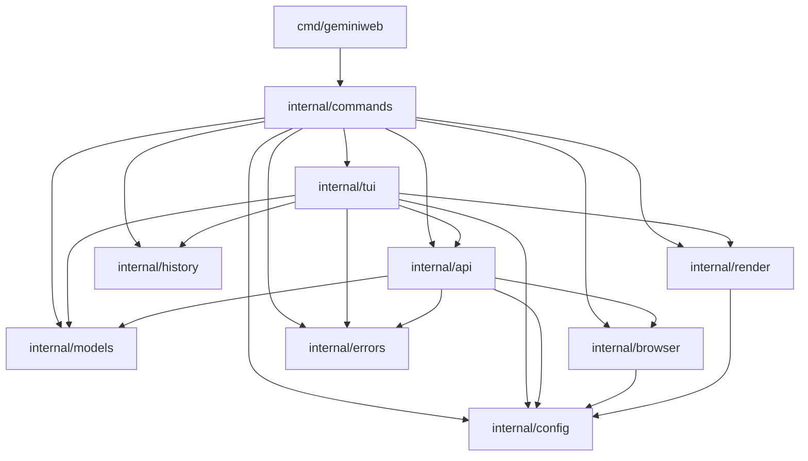

# Dependency Analysis

## Internal Dependencies Map

The `geminiweb-go` project follows a modular structure where most core logic is encapsulated within the `internal/` directory. The dependency flow generally moves from the entry points (`cmd/`) through command handlers (`internal/commands`) and UI logic (`internal/tui`) down to core service clients (`internal/api`) and utility packages.

*   **`cmd/geminiweb`**: The main entry point. It has a single dependency on `internal/commands`.
*   **`internal/commands`**: Orchestrates the CLI. It depends on almost all other internal packages: `api`, `config`, `errors`, `models`, `render`, `tui`, `browser`, and `history`.
*   **`internal/tui`**: Handles the interactive chat interface. It depends on `api`, `config`, `errors`, `history`, `models`, and `render`. It uses interfaces to decouple from specific implementations.
*   **`internal/api`**: The core client for the Gemini Web API. It depends on `browser` (for cookie extraction), `config` (for cookie storage/loading), `models` (for constants and API structures), and `errors`.
*   **`internal/browser`**: Provides browser cookie extraction logic. It depends on `config`.
*   **`internal/render`**: Handles terminal markdown rendering. It depends on `config`.
*   **`internal/history`**: Manages local conversation storage. It is largely self-contained but shares structural similarities with `models`.
*   **`internal/config`**: Base package for configuration and cookie management. It has no internal dependencies.
*   **`internal/models`**: Base package for shared data structures, constants, and API endpoints. It has no internal dependencies.
*   **`internal/errors`**: Centralized error types for the project. It has no internal dependencies.

## External Libraries Analysis

The project leverages several high-quality external libraries to handle complex tasks like bot-detection evasion and TUI rendering:

*   **`github.com/bogdanfinn/tls-client` & `fhttp`**: Critical for bypassing Google's bot detection by providing TLS fingerprinting and HTTP/2 support that mimics real web browsers.
*   **`github.com/browserutils/kooky`**: Used in `internal/browser` to extract session cookies from various local browsers (Chrome, Firefox, Edge, etc.).
*   **`github.com/charmbracelet/bubbletea`**: The foundation for the TUI, implementing the Elm architecture for terminal applications.
*   **`github.com/charmbracelet/lipgloss` & `bubbles`**: Used for styling the TUI and providing common UI components like text areas and viewports.
*   **`github.com/charmbracelet/glamour`**: Used in `internal/render` for high-quality markdown rendering in the terminal.
*   **`github.com/spf13/cobra`**: The CLI framework used to define commands and flags.
*   **`github.com/tidwall/gjson`**: Used in `internal/api` for fast and efficient extraction of values from the complex JSON structures returned by Gemini.
*   **`github.com/atotto/clipboard`**: Used for copying Gemini's responses to the system clipboard.

## Service Integrations

*   **Google Gemini Web API**: The primary external integration. The codebase communicates with Gemini via its internal web endpoints (e.g., `chat.google.com/u/0/_/BardChatUi/data/assistant.lamda.BardFrontendService/GetAnswer`). This is a reverse-engineered integration using cookie-based authentication.
*   **Local Web Browsers**: The application integrates with local browser installations (Chrome, Firefox, Edge, Chromium, Opera) to "steal" session cookies (`__Secure-1PSID` and `__Secure-1PSIDTS`), allowing the user to authenticate without manual token entry.

## Dependency Injection Patterns

The project makes significant use of Dependency Injection (DI) to facilitate testing and modularity:

*   **Functional Options Pattern**: The `GeminiClient` in `internal/api` uses functional options (`WithModel`, `WithBrowserRefresh`, `WithHTTPClient`, etc.) for configuration and injecting dependencies like the HTTP client or the browser extractor.
*   **Interface-based DI**: 
    *   `internal/tui` uses interfaces like `GeminiClientInterface`, `ChatSessionInterface`, and `HistoryStoreInterface`. This allows the UI to be tested with mocks and decouples it from the concrete implementations in `internal/api` and `internal/history`.
    *   `internal/api` uses the `BrowserCookieExtractor` interface to decouple the client from the browser-specific logic.
*   **Constructor Injection**: Most components (e.g., `NewChatModel`, `NewClient`) accept their dependencies through constructors or factories.

## Module Coupling Assessment

*   **Tightly Coupled CLI/TUI**: `internal/commands` and `internal/tui` act as "fat" modules that tie together many different parts of the system. This is expected for application-level packages but limits their reuse.
*   **Loosely Coupled Core**: Packages like `internal/config`, `internal/models`, and `internal/errors` are highly decoupled and act as the "leaf" nodes of the dependency graph.
*   **Cohesion**: The system shows high cohesion within packages. However, there is some structural duplication between `internal/history` and `internal/models` regarding `Message` and `Conversation` types, which suggests a potential area for consolidation.
*   **API Decoupling**: The use of `internal/api` as a standalone client allows it to be used independently of the TUI or CLI, provided the necessary cookies are supplied.

## Dependency Graph

## Potential Dependency Issues

1.  **Direct Configuration Dependency**: Almost every package depends on `internal/config`. While convenient, it makes the core logic (like `internal/api`) dependent on the application's specific configuration file format and location. Injecting raw configuration values or smaller interfaces would improve testability.
2.  **Model Duplication**: `internal/history` defines its own `Message` and `Conversation` structs instead of reusing or extending those in `internal/models`. This can lead to inconsistencies when passing data between the history store and the TUI.
3.  **Cyclic Dependency Risks**: The heavy interaction between `internal/commands`, `internal/tui`, and `internal/api` creates a complex web where circular dependencies could easily be introduced if new features are added without careful interface planning.
4.  **External Dependency on `tls-client`**: The project is heavily dependent on the specific behavior of `bogdanfinn/tls-client`. Any breaking changes or lack of updates to that library could break the ability to connect to Gemini if Google updates its bot-detection mechanisms.