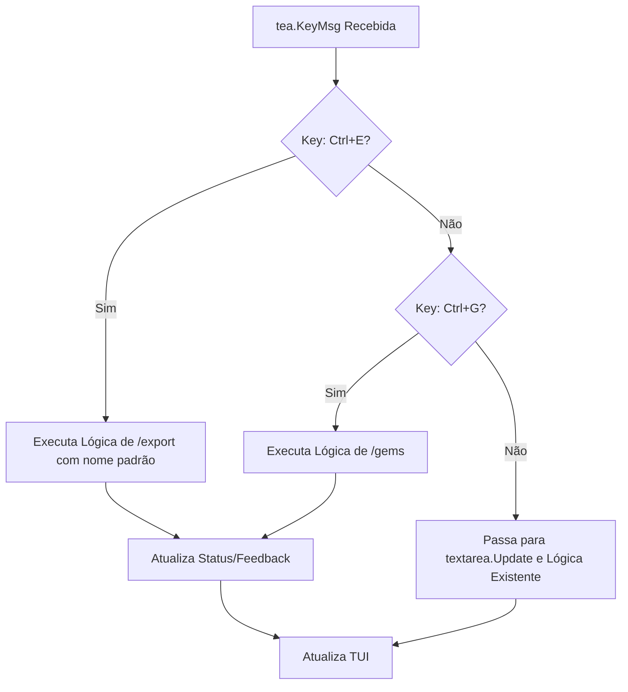

# Plano de Refatoração: Atalhos de Teclado no Chat TUI

## 1. Resumo Executivo e Objetivos

O objetivo principal deste plano é aumentar a usabilidade do modo de chat TUI (Terminal User Interface) do `geminiweb` adicionando atalhos de teclado para funcionalidades de alto valor: **Exportar a Conversa Atual** e **Acessar o Seletor de Gems** (personas).

### Objetivos Principais:

1.  **Implementar atalho `Ctrl+E` (Export):** Permitir a exportação rápida da conversa atual no modo TUI para um arquivo Markdown com nome baseado no título ou timestamp.
2.  **Implementar atalho `Ctrl+G` (Gems):** Fornecer acesso direto ao seletor de Gems sem digitar `/gems`.
3.  **Garantir Ergonomia:** Usar combinações `Ctrl+<letra>` que não conflitam com a digitação normal nem com atalhos essenciais (`Ctrl+C`, `Enter`).
4.  **Atualizar a Barra de Status:** Exibir os novos atalhos para melhorar a descoberta da funcionalidade.

## 2. Análise da Situação Atual

O TUI de chat é implementado em `internal/tui/model.go`. Ele utiliza o framework Bubble Tea (`github.com/charmbracelet/bubbletea`) e a biblioteca `textarea` (`github.com/charmbracelet/bubbles/textarea`) para o input.

- **Entrada de Teclado:** O `Model.Update` gerencia as mensagens de teclado (`tea.KeyMsg`). O `textarea` consome a maioria das teclas de digitação, e a lógica customizada trata comandos (`/gems`, `/export`, etc.) e teclas especiais (`Ctrl+C`, `Enter`).
- **Atalhos Existentes:**
    - `Ctrl+C`: Sai do TUI.
    - `Esc`: Sai do TUI (ou cancela loading/seleção).
    - `Enter`: Envia a mensagem.
    - `\ + Enter`: Insere nova linha (line continuation).
    - `/gems`, `/history`, `/export`, `/file`, `/image`, `/manage`, `/favorite`: Comandos de texto.
- **Funcionalidades Alvo:**
    - **Exportar:** Implementado via comando `/export` em `handleExportCommand`. A lógica de nome de arquivo padrão **já está implementada**.
    - **Acessar Gems:** Implementado via comando `/gems` que ativa o modo `selectingGem`.

## 3. Solução Proposta

A estratégia consiste em interceptar os novos atalhos (`Ctrl+E` e `Ctrl+G`) no `Model.Update` e acionar a mesma lógica de comando existente, simplificando a interação do usuário.

### 3.1. Visão Arquitetural

O `Model.Update` será estendido para tratar `Ctrl+E` e `Ctrl+G` no switch de `tea.KeyMsg`, antes do fluxo de `enter`.



### 3.2. Componentes Afetados

| Componente | Localização | Modificação |
| :--- | :--- | :--- |
| **`Model.Update`** | `internal/tui/model.go:251` | Adicionar cases `ctrl+e` e `ctrl+g` no switch de `tea.KeyMsg`. |
| **`handleExportCommand`** | `internal/tui/model.go:774` | Nenhuma (lógica de nome padrão já existe). |
| **`renderStatusBar`** | `internal/tui/model.go:678` | Adicionar `Ctrl+E` e `Ctrl+G` na lista de atalhos. |

### 3.3. Plano de Ação

#### Fase 1: Implementação dos Atalhos

| Tarefa | Status | Descrição |
| :--- | :--- | :--- |
| 1.1: **Adicionar case `ctrl+g`** | ⬜ Pendente | Adicionar case no switch que ativa `selectingGem` e chama `loadGemsForChat()`. |
| 1.2: **Adicionar case `ctrl+e`** | ⬜ Pendente | Adicionar case que chama `handleExportCommand("")` (sem argumentos). |
| 1.3: **Atualizar `renderStatusBar`** | ⬜ Pendente | Adicionar `Ctrl+E (Export)` e `Ctrl+G (Gems)` na lista de atalhos. |

**Nota:** A tarefa de ajustar `handleExportCommand` para nome padrão foi removida pois **já está implementada** (linhas 776-785).

#### Fase 2: Testes e Validação

| Tarefa | Status | Descrição |
| :--- | :--- | :--- |
| 2.1: **Testes unitários** | ⬜ Pendente | Criar testes em `model_test.go` para simular `tea.KeyMsg{Type: tea.KeyCtrlE}` e `tea.KeyCtrlG`. |
| 2.2: **Teste manual** | ⬜ Pendente | Verificar que `Ctrl+E` exporta corretamente e `Ctrl+G` abre o seletor. |

### 3.4. Mudanças no Modelo de Dados

Nenhuma. A funcionalidade utiliza as estruturas existentes.

### 3.5. Mudanças de Interface/API

Nenhuma. As alterações são internas ao pacote `internal/tui`.

## 4. Considerações e Riscos

### 4.1. Riscos Técnicos

| Risco | Mitigação |
| :--- | :--- |
| **Conflito de atalho no terminal** | O modo `tea.WithAltScreen()` já é utilizado, o que garante que `Ctrl+E`/`Ctrl+G` sejam capturados pelo Bubble Tea. |
| **Exportação sem conversa** | `handleExportCommand` já trata este caso retornando erro "no conversation to export" (linha 819). |
| **Ordem de interceptação** | Os cases devem vir antes do case `enter` no switch para evitar conflitos. |

### 4.2. Dependências

- `FullHistoryStore` é necessário para `/export` funcionar com conversas persistidas, mas exportação in-memory também é suportada.
- `sanitizeFilename` (já implementada) garante nomes de arquivo válidos.

### 4.3. Requisitos Não-Funcionais Atendidos

| Requisito | Contribuição |
| :--- | :--- |
| **Usabilidade** | Elimina a necessidade de digitar comandos para funcionalidades frequentes. |
| **Eficiência** | Acesso mais rápido via atalhos de teclado. |
| **Descoberta** | Barra de status exibe os atalhos disponíveis. |

## 5. Critérios de Validação

1. `Ctrl+E` exporta a conversa para arquivo Markdown com nome baseado no título ou timestamp.
2. `Ctrl+G` abre o seletor de Gems imediatamente.
3. A barra de status exibe `Ctrl+E (Export)` e `Ctrl+G (Gems)`.
4. Os atalhos existentes (`Enter`, `Ctrl+C`, `Esc`, `\+Enter`) continuam funcionando.
5. `Ctrl+E` sem conversa/mensagens exibe erro apropriado.

## 6. Premissas

- O modo `tea.WithAltScreen()` garante captura de `Ctrl+E`/`Ctrl+G` antes do terminal.
- A lógica de nome padrão já está implementada: `sanitizeFilename(conv.Title) + ".md"` ou `conversation_TIMESTAMP.md`.
- `FullHistoryStore` é injetado corretamente via `RunChatWithConversation`.

-----

## Detalhes de Implementação

### Adicionar cases em `Model.Update` (após linha 261, antes do case `enter`)

```go
case "ctrl+g":
	// Atalho para abrir seletor de gems (mesmo que /gems)
	m.textarea.Reset()
	m.selectingGem = true
	m.gemsLoading = true
	m.gemsCursor = 0
	m.gemsFilter = ""
	return m, m.loadGemsForChat()

case "ctrl+e":
	// Atalho para exportar conversa (mesmo que /export sem argumentos)
	// Nota: handleExportCommand JÁ gera nome padrão quando args=""
	return m.handleExportCommand("")
```

**Observação:** Para `Ctrl+E` não é necessário chamar `m.textarea.Reset()` pois a exportação não muda o contexto de input.

### Atualizar `renderStatusBar` (linha 679)

```go
shortcuts := []struct {
	key  string
	desc string
}{
	{"Enter", "Send"},
	{"\\+Enter", "Newline"},
	{"^E", "Export"},  // Ctrl+E
	{"^G", "Gems"},    // Ctrl+G
	{"Esc", "Quit"},
	{"↑↓", "Scroll"},
}
```

**Nota:** Usar `^E` e `^G` ao invés de `Ctrl+E` para economizar espaço na barra de status.