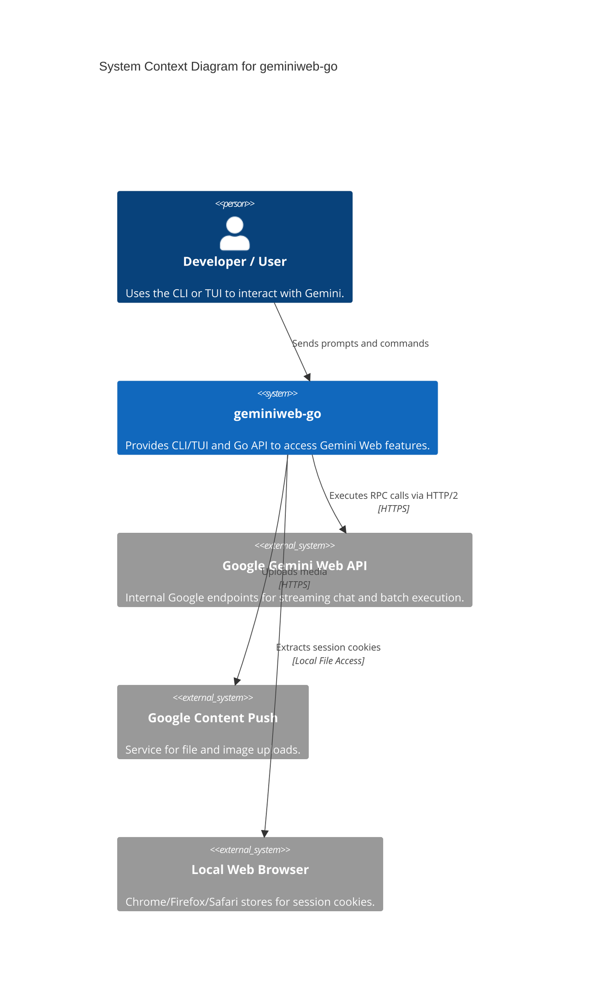

# geminiweb-go

## Project Overview
`geminiweb-go` is a comprehensive Go implementation and CLI tool designed to interact with the private Google Gemini Web API. Unlike the official Google AI SDK, this project specializes in emulating browser-like behavior to unlock advanced features available on the Gemini web interface, such as Gems management, advanced file uploads, and specific model behaviors like "Thinking/Reasoning."

### Key Features
*   **Browser Emulation**: Uses advanced TLS fingerprinting (`tls-client`) and HTTP/2 behavior to mimic Chrome, preventing bot detection.
*   **Interactive TUI**: A rich terminal user interface built with the "Charm" stack (Bubble Tea, Lip Gloss) for a seamless chat experience.
*   **Gems Management**: Programmatic access to list and use server-side personas (Gems).
*   **Multimodal Support**: Support for uploading images and files directly to Google's content-push service.
*   **Automated Authentication**: Ability to extract session cookies directly from local browser installations (Chrome, Firefox, etc.) and handle automatic cookie rotation.
*   **Tool Execution Framework**: A modular system for executing external tools with security policies and manual confirmation hooks.

## Table of Contents
*   [Architecture](#architecture)
*   [C4 Model Architecture](#c4-model-architecture)
*   [Repository Structure](#repository-structure)
*   [Dependencies and Integration](#dependencies-and-integration)
*   [API Documentation](#api-documentation)
*   [Development Notes](#development-notes)
*   [Known Issues and Limitations](#known-issues-and-limitations)
*   [Additional Documentation](#additional-documentation)

## Architecture
The project follows a **Layered Modular Monolith** architecture, ensuring a clean separation between the presentation layer, service logic, and infrastructure.

### Technology Stack
*   **Language**: Go
*   **CLI Framework**: [Cobra](https://github.com/spf13/cobra)
*   **TUI Framework**: [Bubble Tea](https://github.com/charmbracelet/bubbletea)
*   **Networking**: [tls-client](https://github.com/bogdanfinn/tls-client) for browser fingerprinting.
*   **Data Parsing**: [gjson](https://github.com/tidwall/gjson) for handling deeply nested Google RPC responses.

### Key Design Patterns
*   **Model-View-Update (MVU)**: Drives the TUI state management.
*   **Functional Options**: Used for flexible configuration of the API client and tool executor.
*   **Middleware**: Implemented in the tool execution pipeline for security and logging.
*   **Registry Pattern**: Allows dynamic discovery and registration of executable tools.

## C4 Model Architecture

<details>
<summary>View Context Diagram</summary>


</details>

<details>
<summary>View Container Diagram</summary>

```mermaid
C4Container
    title Container Diagram for geminiweb-go

    Container(cli, "CLI / TUI Layer", "Cobra, Bubble Tea", "Handles user input and terminal rendering.")
    Container(api_client, "Gemini Client", "internal/api", "Manages auth, session state, and RPC communication.")
    Container(history, "History Store", "internal/history", "Persists conversations as JSON files.")
    Container(browser_bridge, "Browser Bridge", "internal/browser", "Extracts and decrypts cookies from local browsers.")
    Container(tool_exec, "Tool Executor", "pkg/toolexec", "Runs external tools and validates security policies.")

    Rel(cli, api_client, "Uses")
    Rel(cli, history, "Reads/Writes")
    Rel(api_client, browser_bridge, "Requests cookies")
    Rel(api_client, tool_exec, "Invokes tool calls")
    
    Rel_Ext(api_client, "Google Gemini API", "Streaming JSON/RPC")
```
</details>

## Repository Structure
*   `cmd/geminiweb/`: Main entry point for the CLI application.
*   `internal/api/`: Core service for Gemini Web API communication and payload construction.
*   `internal/tui/`: Implementation of the interactive terminal user interface.
*   `internal/commands/`: Cobra command definitions and CLI orchestration.
*   `internal/history/`: File-based persistence logic for chat sessions.
*   `internal/browser/`: Logic for extracting cookies from desktop browsers.
*   `pkg/toolexec/`: A standalone, modular framework for tool (function) execution.
*   `internal/models/`: Shared data structures across the project.

## Dependencies and Integration
### External Service Dependencies
*   **Gemini Web API (`gemini.google.com`)**: Interacts with `StreamGenerate` for chat and `batchexecute` for Gems management.
*   **Google Content Push**: Used specifically for image and file processing.
*   **Google Accounts Rotation**: Integrated for extending session validity.

### Internal Integrations
*   **Local Browser Files**: Directly accesses SQLite databases of local browsers (e.g., Chrome, Firefox) to facilitate "Auto-Login" by retrieving `__Secure-1PSID` and other critical cookies.

## API Documentation
### Go Package API (`internal/api`)
The `GeminiClient` provides programmatic access for Go developers:

| Method | Description |
| :--- | :--- |
| `GenerateContent(prompt, opts)` | Sends a text prompt (and optional files) and returns a streaming response. |
| `UploadFile(path)` | Uploads a local file and returns a `ResourceID` for use in prompts. |
| `FetchGems(includeHidden)` | Retrieves available personas (Gems) for the current session. |

### CLI Interface
| Command | Purpose |
| :--- | :--- |
| `geminiweb chat` | Starts an interactive TUI session. |
| `geminiweb "prompt"` | One-shot query from the command line. |
| `geminiweb gems list` | Displays available custom personas. |
| `geminiweb import-cookies` | Imports session state from a JSON file. |

## Development Notes
*   **Authentication**: The system relies on cookie-based authentication. If sessions expire, the client can automatically trigger a refresh by scanning local browser profiles.
*   **TLS Fingerprinting**: Always use the `tls-client` library to ensure requests are not flagged as bot traffic.
*   **Testing**: UI components use interfaces to allow for mocking the `GeminiClient` during testing.

## Known Issues and Limitations
*   **Brittle Protocol**: Since the project relies on undocumented internal Google APIs, upstream changes to field indices in the nested JSON arrays can cause parsing failures.
*   **TLS Dependency**: Dependency on `bogdanfinn/tls-client` is critical; if this library lags behind browser updates, detection risk increases.
*   **Model Duplication**: There is some minor overlap between structures in `internal/models` and `internal/history` that may require future consolidation.

## Additional Documentation
*   [Tool Execution Protocol](pkg/toolexec/doc.go) - Detailed documentation on the modular tool framework.
*   [Project Operations Guide](CLAUDE.md) - Build, test, and style guidelines for contributors.

---
*Note: This documentation is generated based on automated code analysis.*