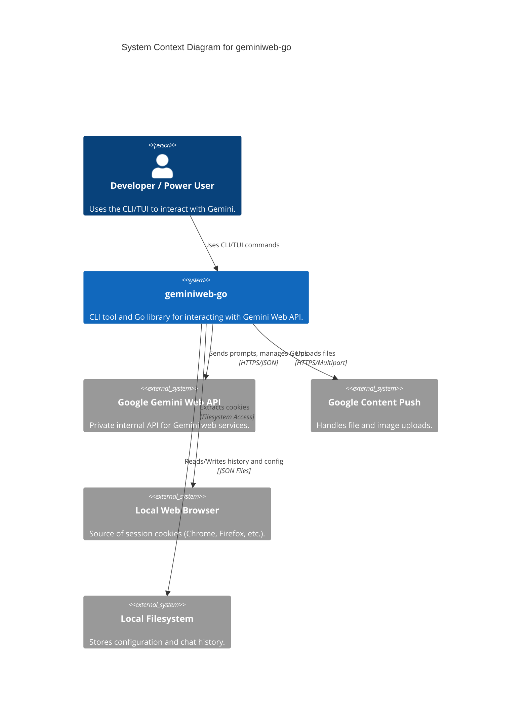
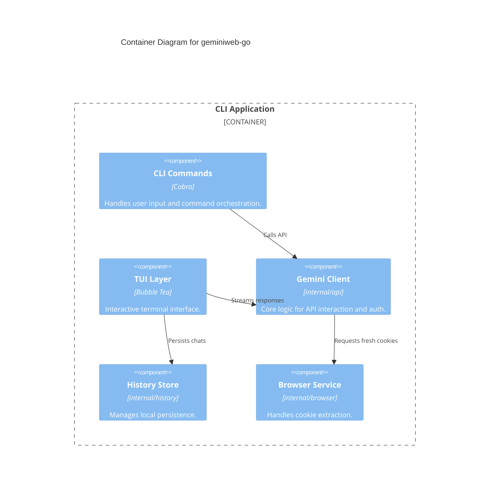

# geminiweb-go

## Project Overview
`geminiweb-go` is a sophisticated command-line interface (CLI) and Go library designed to interact with the private Google Gemini web API. By emulating authentic browser behavior, it provides access to features often unavailable in public SDKs, such as advanced file uploads, Gems (custom personas) management, and specific web-only model behaviors.

The project is built with a focus on modularity and testability, following Clean Architecture principles. It caters to power users seeking a terminal-optimized Gemini experience and developers looking to integrate web-level Gemini capabilities into Go applications.

**Key Features:**
*   **Interactive TUI**: A rich terminal user interface built with the Bubble Tea framework.
*   **Browser Emulation**: Uses TLS fingerprinting and custom HTTP clients to mimic real browsers (Chrome 133), bypassing basic anti-bot detections.
*   **Automated Authentication**: Automatically extracts and refreshes session cookies (`__Secure-1PSID`, `__Secure-1PSIDTS`) from local browser profiles (Chrome, Firefox, Edge, etc.).
*   **Gems Management**: Create, list, and interact with server-side custom personas.
*   **Local History**: Persistent storage of conversations in JSON format with search and export capabilities.
*   **Advanced File Handling**: Support for uploading images and text files directly to Google's content-push services.

## Table of Contents
1. [Architecture](#architecture)
2. [C4 Model Architecture](#c4-model-architecture)
3. [Repository Structure](#repository-structure)
4. [Dependencies and Integration](#dependencies-and-integration)
5. [API Documentation](#api-documentation)
6. [Development Notes](#development-notes)
7. [Known Issues and Limitations](#known-issues-and-limitations)
8. [Additional Documentation](#additional-documentation)

## Architecture
`geminiweb-go` follows a **Clean/Hexagonal architecture**, prioritizing separation of concerns and the use of interfaces to decouple the core logic from external dependencies.

*   **Technology Stack**:
    *   **Language**: Go
    *   **CLI Framework**: Cobra
    *   **TUI Framework**: Bubble Tea (Charmbracelet)
    *   **HTTP Client**: `tls-client` (for TLS fingerprinting)
    *   **Data Parsing**: GJSON (for high-performance nested JSON extraction)
    *   **Markdown Rendering**: Glamour

*   **Key Design Patterns**:
    *   **The Elm Architecture (MVU)**: Powering the interactive TUI.
    *   **Functional Options**: Used for flexible configuration of the `GeminiClient`.
    *   **Repository Pattern**: Abstracting the local filesystem storage for chat history.
    *   **Strategy Pattern**: Used for browser-specific cookie extraction logic.
    *   **Proxy/Wrapper**: `ChatSession` wraps the core client to maintain conversation context (CID, RID, RCID).

## C4 Model Architecture

System Context Diagram

Container Diagram

## Repository Structure
*   `cmd/`: Main entry points for the `geminiweb` binary.
*   `internal/api/`: Core API client implementation, including payload building and response parsing.
*   `internal/commands/`: CLI command definitions (Cobra).
*   `internal/tui/`: Interactive TUI logic (Bubble Tea).
*   `internal/history/`: Logic for local conversation storage and indexing.
*   `internal/browser/`: Utilities for extracting session cookies from local browsers.
*   `internal/models/`: Shared data structures and constants.
*   `internal/config/`: Configuration management and cookie persistence.
*   `internal/render/`: Markdown rendering services for the terminal.

## Dependencies and Integration
The project integrates with several external services and local environments:

*   **Google Gemini Web API**: The primary service integration, accessed via reverse-engineered endpoints.
*   **Google Content Push**: Utilized for file and image uploads (`content-push.googleapis.com`).
*   **Google Accounts**: Used for session maintenance and cookie rotation.
*   **Local Web Browsers**: Integrated with Chrome, Firefox, Edge, Chromium, and Opera for automated authentication via cookie extraction.
*   **External Libraries**: Heavily relies on `bogdanfinn/tls-client` for browser fingerprinting and `charmbracelet` libraries for the terminal UI.

## API Documentation

### CLI Interface
| Command | Purpose |
| :--- | :--- |
| `geminiweb [prompt]` | Send a single prompt and receive a response. |
| `geminiweb chat` | Launch the interactive TUI. |
| `geminiweb gems` | Manage server-side custom personas. |
| `geminiweb history` | Search, list, or export local conversation history. |
| `geminiweb config` | Manage application settings and local personas. |

### Go Package API (`internal/api`)
Developers can use the `GeminiClient` directly:
*   `GenerateContent(prompt string, opts *GenerateOptions)`: Main method for generating AI responses.
*   `UploadFile(filePath string)`: Uploads files to Google services for use in prompts.
*   `RefreshFromBrowser()`: Triggers the automated cookie extraction flow.

## Development Notes
*   **Project-Specific Conventions**:
    *   Extensive use of interfaces to facilitate testing and mocking (e.g., `GeminiClientInterface`).
    *   API response parsing is centralized in `internal/api/paths.go` to manage the complex GJSON selectors required for the private API.
*   **Testing**: UI components are decoupled from the API via interfaces, allowing for comprehensive TUI testing without hitting live endpoints.
*   **Performance**: Utilizes `GJSON` for fast, path-based extraction from large, nested JSON responses returned by Google.

## Known Issues and Limitations
*   **Model Duplication**: There is currently some structural duplication between `internal/history` and `internal/models` regarding `Message` and `Conversation` types.
*   **Private API Fragility**: As the project relies on undocumented Google endpoints, changes to Google's internal API structure may require updates to the parsing logic in `paths.go`.
*   **Dependency on `tls-client`**: Maintaining browser emulation depends on the upstream `tls-client` library's ability to mimic the latest browser fingerprints.
*   **Configuration Coupling**: Many internal packages have a direct dependency on `internal/config`, which could be improved via further dependency injection.

## Additional Documentation
For more detailed technical insights, refer to the internal documentation (note: these links are representative of the repository structure):
*   [Architecture Rules & Conventions](.cursor/rules/project-overview.mdc)
*   [History System Design](.serena/memories/history-system.md)
*   [Client Lifecycle & Auth Flow](.serena/memories/client-lifecycle.md)

---
*Note: Additional documentation regarding a unified model consolidation strategy and detailed reverse-engineered protocol specifications would be beneficial for future contributors.*
