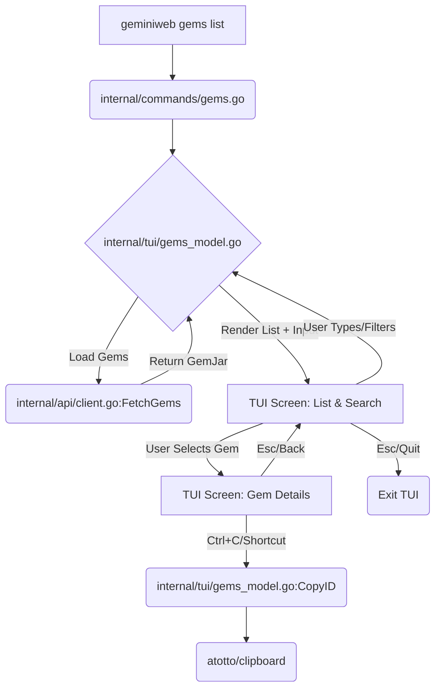

## 1\. Executive Summary & Goals

Este plano tem como objetivo modernizar e aprimorar a interface de usuário (TUI - Terminal User Interface) para a listagem e gestão de **Gemini Gems** (personas customizadas) no aplicativo `geminiweb-go`. A nova TUI deve oferecer uma experiência de usuário rica, alinhada com o padrão `charmbracelet/bubbletea` já adotado, incluindo funcionalidades críticas de **filtragem fuzzy** em tempo real e um **atalho de teclado para cópia do Gem ID**.

### Key Goals

1.  **Usabilidade Aprimorada:** Substituir a listagem atual baseada em `tabwriter` no comando `gems list` por uma TUI interativa (`bubbletea`) para navegação, filtragem e seleção.
2.  **Filtragem Rápida e Fuzzy:** Implementar um mecanismo de busca fuzzy (aproximada) que filtre a lista de Gems em tempo real por nome e/ou descrição.
3.  **Visualização Detalhada e Ação Rápida:** Permitir a seleção de um Gem para exibir seus detalhes completos e um atalho de teclado (`ctrl+c` ou similar) para copiar o seu ID.
4.  **Integração Coesa:** Reutilizar os estilos e componentes TUI existentes (`internal/tui/styles.go`, `charmbracelet/lipgloss`) para manter o padrão visual do aplicativo.

-----

## 2\. Current Situation Analysis

O projeto `geminiweb-go` é uma aplicação CLI em Go que utiliza o framework `cobra` para comandos e `charmbracelet/bubbletea` para interfaces interativas (TUI), como o chat e o menu de configuração.

| Componente | Status Atual | Problema/Limitação |
| :--- | :--- | :--- |
| **Comando `gems`** | Implementado em `internal/commands/gems.go`. | A sub-rotina `runGemsList` utiliza `text/tabwriter` para saída estática. Não permite interação, filtro ou seleção. |
| **Lógica de Gems** | `internal/api/gems.go`, `internal/api/client.go` e `internal/models/gems.go` estão bem definidos com lógica de busca, criação e cache. | A API de backend e o modelo de dados estão prontos. A limitação é puramente na camada de **apresentação** (`TUI`). |
| **TUI Base** | Implementada em `internal/tui/model.go` e `internal/tui/styles.go` usando `bubbletea`, `bubbles`, e `lipgloss`. | A TUI de configuração (`internal/tui/config_model.go`) e a de chat (`internal/tui/model.go`) servem como bom ponto de partida, mas é necessário um novo modelo TUI (`Model`) específico para a gestão de Gems. |
| **Busca Fuzzy** | Não implementada. | Nenhuma biblioteca de busca fuzzy está sendo utilizada ou exposta para uso interativo no TUI. |

-----

## 3\. Proposed Solution / Refactoring Strategy

O plano é criar um novo modelo TUI (`GemsModel`) para substituir a saída estática do `gems list` e adicionar a lógica de filtragem, seleção e cópia.

### 3.1. High-Level Design / Architectural Overview

O novo fluxo envolverá a migração do comando `gems list` para um novo subcomando que invocará um novo TUI Model.

1.  **Nova Estrutura TUI:** Criar `internal/tui/gems_model.go` para a lógica de estado do TUI.
2.  **Injeção de Dependência:** O `GemsModel` receberá o `api.GeminiClientInterface` para carregar a lista de Gems.
3.  **Componente de Busca:** Utilizar `charmbracelet/bubbles/textinput` para a busca fuzzy e `charmbracelet/bubbles/list` (ou implementar uma lista customizada) para exibir os resultados.
4.  **Cópia de ID:** Utilizar o pacote `github.com/atotto/clipboard` que já está em uso (`go.mod`, `internal/commands/query.go`) para implementar a cópia do ID.

**Fluxo de Interação Proposto:**

-----

### 3.2. Key Components / Modules

| Componente | Responsabilidade | Status |
| :--- | :--- | :--- |
| `internal/tui/gems_model.go` | **Novo** - Lógica principal do TUI de Gems. Gerencia estados (listagem, detalhes), cursor, busca, e a interação do usuário. | Novo |
| `internal/commands/gems.go` | **Modificado** - Atualizar `runGemsList` para invocar o novo `gems_model.go` em vez de usar `tabwriter`. | Modificação |
| `internal/tui/styles.go` | **Reutilizado/Ajustado** - Definir estilos `lipgloss` específicos para a lista e a visualização detalhada de Gems. | Reutilização |
| `GemsFuzzyFilter` | **Nova Lógica** - Módulo ou função dentro de `gems_model.go` que utiliza `strings.Contains` ou uma biblioteca mais robusta (ex: `junegunn/fzf` ou custom fuzzy match) para filtrar a lista de `models.Gem` baseada no input. | Novo |

-----

### 3.3. Detailed Action Plan / Phases

#### Phase 1: Substituição da Listagem Estática pelo TUI Base (M/L)

**Objective(s):** Substituir o `tabwriter` por uma interface interativa `bubbletea` que exibe a lista de Gems.
**Priority:** High

| Task | Rationale/Goal | Effort | Deliverable/Criteria for Completion |
| :--- | :--- | :--- | :--- |
| **1.1** Criar `internal/tui/gems_model.go` e `RunGemsTUI`. | Inicializar a estrutura `tea.Model` para o TUI de Gems. | M | Arquivo `gems_model.go` com estrutura `Model`, `Init`, `Update`, `View`. |
| **1.2** Implementar a busca e o carregamento inicial de Gems. | Chamar `client.FetchGems(true)` na inicialização e armazenar no estado do Model. | S | `gems_model.go` carrega a lista de Gems e exibe os nomes na `View`. |
| **1.3** Modificar `internal/commands/gems.go`. | Substituir a lógica `tabwriter` em `runGemsList` pela invocação de `tui.RunGemsTUI(client)`. | S | `runGemsList` invoca a nova TUI. |
| **1.4** Implementar navegação básica na lista. | Usar o componente `list` (ou custom `cursor`/`viewport`) para permitir navegação com `j/k` ou `up/down`. | M | Lista de Gems navegável, com item selecionado visualmente destacado. |

#### Phase 2: Implementação da Busca Fuzzy e Detalhes (L)

**Objective(s):** Adicionar a caixa de busca fuzzy e a tela de detalhes do Gem.
**Priority:** High

| Task | Rationale/Goal | Effort | Deliverable/Criteria for Completion |
| :--- | :--- | :--- | :--- |
| **2.1** Integrar `textinput` para a busca. | Adicionar `textinput.Model` ao `GemsModel` para capturar a entrada do usuário. | S | Input de busca visível no topo do TUI. |
| **2.2** Implementar a lógica de Filtro Fuzzy. | Filtrar o `GemJar` pelo `Name` e `Description` usando o valor do `textinput` a cada `tea.KeyMsg`. Uma busca **case-insensitive** simples com `strings.Contains` é suficiente para ser "fuzzy o bastante" no contexto CLI. | M | A lista de Gems é filtrada em tempo real enquanto o usuário digita. |
| **2.3** Implementar a visualização de Detalhes. | Criar um novo estado (`viewDetails`) no `GemsModel` para exibir `ID`, `Name`, `Description` e `Prompt` do Gem selecionado (Markdown renderizado). | L | Tela de detalhes exibida ao pressionar `Enter` na lista. |
| **2.4** Reutilizar estilos TUI. | Aplicar os estilos de `internal/tui/styles.go` para a lista e detalhes (cores, bordas, etc.) para manter a coerência visual. | S | Nova TUI alinhada visualmente com o TUI de Chat/Config. |

#### Phase 3: Implementação do Atalho de Cópia e Finalização (S)

**Objective(s):** Adicionar o atalho de cópia do ID e refinar a usabilidade.
**Priority:** High

| Task | Rationale/Goal | Effort | Deliverable/Criteria for Completion |
| :--- | :--- | :--- | :--- |
| **3.1** Implementar o atalho de Cópia do ID. | Mapear uma combinação de teclas (e.g., `c` ou `ctrl+c`) na tela de **Detalhes** para copiar o `Gem.ID` para o clipboard usando `clipboard.WriteAll`. | S | Pressionar o atalho copia o ID e exibe um feedback visual (ex: "ID copiado"). |
| **3.2** Refinamento da barra de status. | Adicionar informações de atalhos (`/` para buscar, `Enter` para detalhes, `Esc` para sair/voltar, atalho de cópia) na barra de status. | S | Barra de status do `GemsModel` com atalhos claros. |
| **3.3** Testes Manuais e Refatoração de Código. | Garantir que a lógica de estado e as transições de visão funcionem corretamente sem vazamentos de memória ou falhas de renderização. | S | TUI estável e funcional, sem erros visuais. |

-----

### 3.4. Data Model Changes

**Nenhuma alteração necessária** no modelo de dados (`internal/models/gems.go`) ou na API de acesso (`internal/api/gems.go`), pois o cache (`models.GemJar`) já contém todas as informações necessárias.

### 3.5. API Design / Interface Changes

**Nenhuma alteração necessária** nas interfaces ou endpoints da API. A nova funcionalidade é puramente uma modificação da camada de apresentação (TUI).

-----

## 4\. Key Considerations & Risk Mitigation

### 4.1. Technical Risks & Challenges

| Risco | Descrição | Estratégia de Mitigação |
| :--- | :--- | :--- |
| **Dependência de Biblioteca Fuzzy** | A adição de uma biblioteca de terceiros para busca fuzzy (`github.com/junegunn/fzf/src/matcher`) pode aumentar o tamanho do binário e complexidade. | **Mitigação:** Começar com uma busca "fuzzy o bastante" simples usando `strings.Contains` (case-insensitive) na `Model.Update`. Se a performance for um problema, considerar um TUI toolkit como `bubbles/list` que já tem capacidades de filtragem. |
| **Performance de Renderização** | Em listas muito grandes de Gems, a renderização de Markdown na tela de detalhes (Task 2.3) e a atualização de lista a cada tecla digitada (Task 2.2) podem causar lentidão (lag). | **Mitigação:** Implementar um **debouncing** na função de filtro (se a lista for muito grande) e usar o `glamour` com **pooling** de renderizadores (`internal/render/cache.go`) para a renderização de Markdown, que já é prática do projeto. |
| **Atalho `Ctrl+C`** | `Ctrl+C` é usado por `bubbletea` como sinal de saída. | **Mitigação:** Usar uma tecla alternativa para cópia, como `c` (simples) ou `ctrl+y` (yank), e reservar `ctrl+c` para sair. Na tela de detalhes, a tecla `c` será preferível para não gerar conflito. |

### 4.2. Dependencies

  * **Internas:** `internal/api/client.go` (para `FetchGems`), `internal/tui/styles.go` (para estilos), `internal/render` (para renderizar `Prompt` em detalhes).
  * **Externas:** `github.com/charmbracelet/bubbletea`, `github.com/charmbracelet/bubbles`, `github.com/charmbracelet/lipgloss`, `github.com/atotto/clipboard`.

### 4.3. Non-Functional Requirements (NFRs) Addressed

  * **Usabilidade (NFR Principal):** O novo TUI interativo e a busca em tempo real melhoram drasticamente a usabilidade em relação à listagem estática. A navegação por teclado e a visualização detalhada são padrão ouro em UX de CLI moderna.
  * **Performance:** A reutilização do `internal/render` com caching de renderizadores minimiza o impacto da renderização do Markdown. A busca baseada em strings simples é inerentemente rápida para listas de tamanho moderado.
  * **Manutenibilidade:** A nova funcionalidade é isolada em um novo TUI Model (`gems_model.go`), seguindo o padrão M-U-V (Model-Update-View) do `bubbletea`, o que a torna modular e fácil de manter/testar.

-----

## 5\. Success Metrics / Validation Criteria

  * **Funcionalidade:** O comando `geminiweb gems list` abre a interface TUI interativa.
  * **Busca:** Digitar uma substring de nome/descrição de um Gem deve filtrar a lista de forma correta e rápida (sub-50ms por tecla).
  * **Cópia:** Pressionar o atalho de cópia na tela de detalhes deve colocar o `Gem.ID` no clipboard e exibir uma notificação visual temporária.
  * **Coerência Visual:** A aparência do TUI de Gems deve ser consistente com a TUI de Chat/Configuração, utilizando os mesmos estilos (`internal/tui/styles.go`).

-----

## 6\. Assumptions Made

1.  **Compatibilidade com Clipboard:** Assume-se que o pacote `github.com/atotto/clipboard` funciona corretamente no ambiente de execução do usuário (o que geralmente requer ferramentas de sistema operacional como `xclip` ou `pbcopy`).
2.  **Tamanho da Lista de Gems:** Assume-se que a lista de Gems do usuário não excederá algumas centenas, tornando a busca linear (`strings.Contains`) aceitável em termos de performance.
3.  **Requisitos de Infraestrutura:** O `api.GeminiClient` está inicializado e autenticado ao entrar no TUI (conforme já é feito no `gems.go` atual).

-----

## 7\. Open Questions / Areas for Further Investigation

  * **Biblioteca Fuzzy:** Devo usar uma biblioteca de busca fuzzy mais sofisticada (e.g., para busca por caracteres não adjacentes) ou a busca por substring simples será considerada "fuzzy o bastante" para a primeira versão?
  * **UX do Atalho de Cópia:** Qual atalho será mais intuitivo para "copiar ID" na tela de detalhes, minimizando conflitos com atalhos globais do terminal e com o TUI? (Recomendação: `c` ou `ctrl+y`).